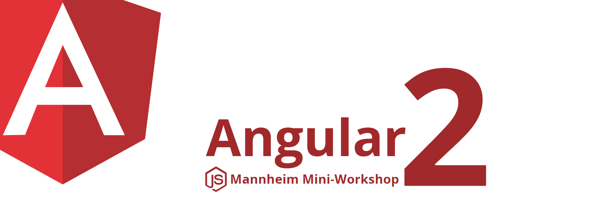

# DEMO

### https://angular-buch.com/node-mini-workshop/

# Node.js Meetup Mannheim 

Many thanks, it was a [great meetup!](http://www.meetup.com/de-DE/node-js-Mannheim/events/235013562/)

----

# BookRating

This project was generated with [angular-cli](https://github.com/angular/angular-cli) version 1.0.0-beta.18.

## Development server
Run `ng serve` for a dev server. Navigate to `http://localhost:4200/`. The app will automatically reload if you change any of the source files.

## Code scaffolding

Run `ng generate component component-name` to generate a new component. You can also use `ng generate directive/pipe/service/class`.

## Build

Run `ng build` to build the project. The build artifacts will be stored in the `dist/` directory. Use the `-prod` flag for a production build.
